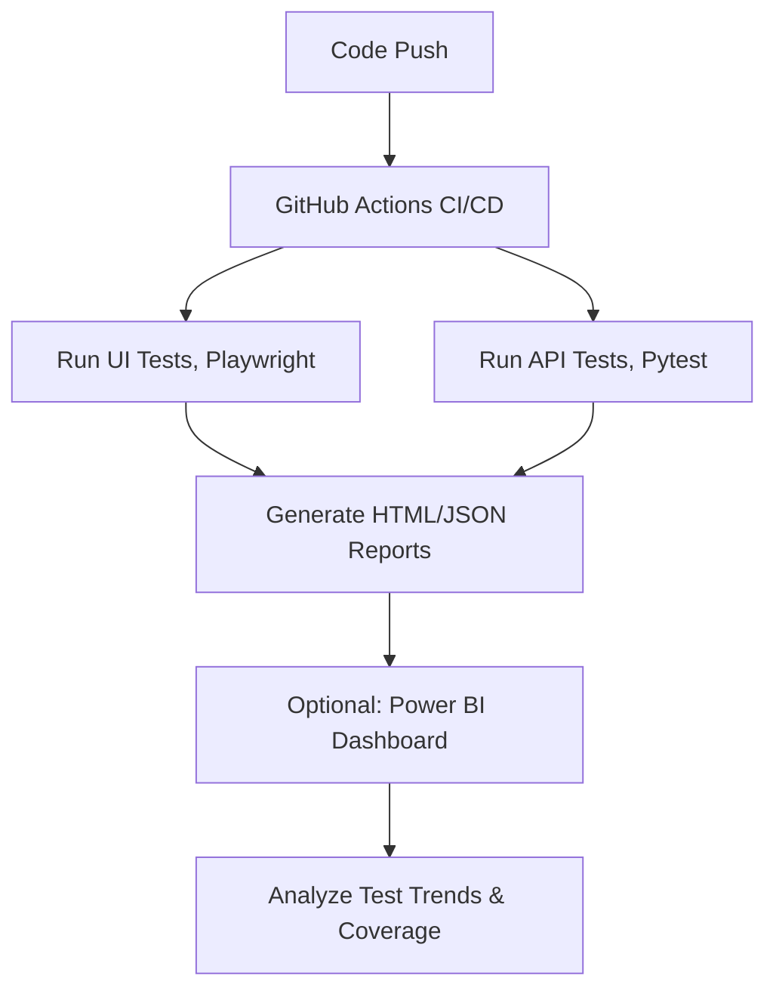

# ⚡Web Automation Demo — UI & API Testing


## 🛰 Overview

This project demonstrates a **complete QA Automation workflow** for modern web applications:

- **🌐 UI Automation:** Browser-based testing with Playwright. For web/ui [SauceDemo](https://www.saucedemo.com)
- **🔌 API Automation:** REST CRUD testing with pytest. For web/api [Reqres](https://reqres.in)
- **⚙  CI/CD Integration:** GitHub Actions running automated tests on every push.  
- **📊 Reporting & Analytics:** HTML/JSON reports, with future integration into Power BI dashboards.  
- **🎯 Goal:** Showcase end-to-end QA engineering skills—from test design to automated execution in the cloud.


## 🧩 Tech Stack

| Component         | Technology                          | 
|-------------------|-------------------------------------|
| Language          | Python 3.11                         |
| Test Framework    | Pytest                              |
| UI Automation     | Playwright                          |
| API Testing       | Requests + Pytest                   |
| CI/CD             | GitHub Actions                      |
| Reporting         | Pytest HTML & JSON, Power BI(opt.)  |


## 🚀 Project Structure
```
📦 `.github/`
├── workflows/
│   └── python-test.yml   # CI/CD workflow

🧪 `tests/`
├── ui/                   # UI automation tests (Playwright)
├── api/                  # API automation tests (CRUD, login)
└── conftest.py           # Shared fixtures

📊 `reports/`             # Test reports (HTML/JSON)
📄 `README.md`           # Project documentation
```

## 🧪 Running Tests Localy
```bash
pip install -r requirements.txt #install dependencies 
python -m venv venv #create virutal envionment 
.\venv\Scripts\Activate.ps1  # Windows PowerShell
pytest --html=reports/report.html --self-contained-html #Run test and generate reports
```

## ⚙ Workflow Diagram



## 📊 Reporting & Dashboard

Pytest HTML reports generated on every run.
JSON output ready for ingestion into Power BI or other dashboards.
Future plans: Interactive QA dashboard to visualize pass/fail trends, API coverage, and flaky test detection.